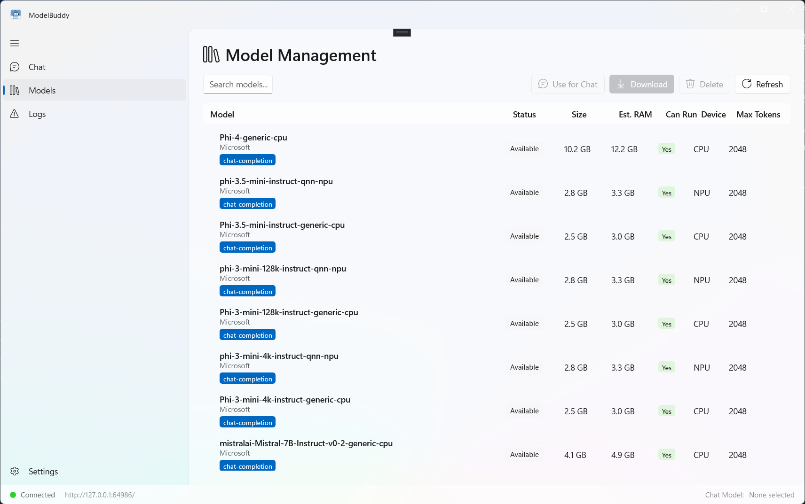

# Model Buddy

A WinUI 3 desktop companion for managing and chatting with on-device AI models via [Foundry Local](https://github.com/microsoft/Foundry-Local).




## Features

- **Chat** — Stream responses from on-device models with Markdown rendering, stop generation, and full conversation history
- **Models** — Browse the Foundry Local catalog, download, delete, and select models for chat with size / RAM / device info
- **Logs** — View application, Foundry Local, and Windows Event logs with level and source filtering
- **Settings** — Theme selection, customizable system instructions, custom Foundry endpoint, and app info

## Prerequisites

- Windows 10 (version 1809) or later
- [Foundry Local](https://github.com/microsoft/Foundry-Local) runtime:

```powershell
winget install Microsoft.FoundryLocal
foundry --version
```

## Build

```powershell
dotnet build ModelBuddy\ModelBuddy.csproj -p:Platform=x64
```

Supported platforms: `x64`, `x86`, `ARM64`.

## Settings

The Settings page (gear icon) lets you customize the app without touching code.

| Section | Setting | Description | Default |
|---------|---------|-------------|---------|
| **Appearance** | App theme | Light, Dark, or use system setting | Use system setting |
| **Chat** | System instructions | Describe how the AI assistant should behave. Content safety guidelines are always appended automatically and cannot be removed. | *"You are Model Buddy, a helpful, friendly, and responsible AI assistant."* |
| **Connection** | Foundry Local endpoint | Override the auto-detected endpoint. Leave empty to auto-detect. Reconnect from the status bar after changing. | Auto-detect |
| **About** | — | App version, GitHub link, license link | — |

### Content safety

Users may edit or extend the system instructions, but the built-in content safety guidelines are **always** appended to every chat request and cannot be modified or removed through settings.

## Acknowledgements

Model Buddy was inspired by [FoundryWebUI](https://github.com/itopstalk/FoundryWebUI) by Orin Thomas.

## License

See [LICENSE.txt](LICENSE.txt).
